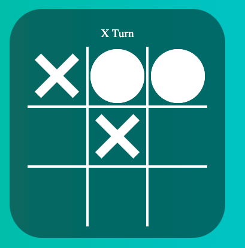

# Tic-Tac-Toe
The very well known game Tic-Tac-Toe is back and more popular than ever! Tic-Tac-Toe is game that you can quickly learn the rules and have fun with your friends and family everywhere.
Practice your strategies and become better and better. Tic-Tac-Toe is a family friendly game that can be played by the whole family of different ages and they will all know that the game is about.

Get to know different strategies and train your brain to become quicker and quicker.
Are you ready?

## Purpose
------

Purpose of this project is to showcase my abilities in HTML, CSS and specially JavaScript to accomplish project 2 of Code Institute course. 
Project was chosen to challenge my abilities and understanding of JavaScript concepts taught on the course and to use it to showcase my abilities for potential employers.

## UX design
------

Ux design developed to be mobile first and user friendly.
Fonts and color Pallet chosen to be playful and easy to read.

- Index Page
    - Landing page designed to be simple but at the same time give user all the information he needs.
    - Game Name at the top of the page.
    - Indication of Player's turn in text as well as hover effect.
    - Block Symbol added when player tries to select a non empty cell.

## Features
------

- Header:
    - Header to clearly tell the users what game they are playing.
    - Font Pacific taken from Google Fonts.

- Game options:
    - User can select any of the empty cells to mark with their symbol(X or Circle).
    - Block Symbol added when player tries to select a non empty cell.

- Player's Turn Indication:  
    - Indication of Player's turn in text and hover effect.
    - Indication of Player's turn with a hover effect

- Game Result:
    - Searching throw every win combination after every play to check if there is already a winner.
    - Display on the screen who won and a restart button added.

- Score Count:
    - Score count showing score of both players.

- Footer:
    - Footer with copywright information.

## Testing
------

- Website tested with two different browsers(Chrome, Firefox).

- Responsiveness of website tested and can confirm it is retaining design and readability on all screen sizes.

- I confirmed Home Page is readable and easy to understand.

- Tested all win scenarios to check if winning check is being carried out correctly.

- Tested all draw scenarios to check if draw check is being carried out correctly.

- Game changing turns properly.

- Confirmed all cells have an event listener.

- Restart button working properly, removing everything from last game and restarting new.

### Bugs

##### Solved Bugs

- Draw checking wasn't working properly after, had to do some extra studying to understand how I could check if every cell was filled. Discovered how to use every() method for my cellElements.

### Validator Testing
- HTML: 
    - No errors were returned when passing through the official W3C validator.

- CSS: 
    - No errors were returned when passing through the official (jigsaw)) validator.

- Acessibility
    - I confirmed that the colors and fonts chosen are easy to read and accessible by running through lighthouse in devtools.

### Unfixed Bugs
No unfixed bugs

## Deployment
------

- The site was deployed to GitHub pages. The steps deploy are as follows:
    - In the GitHub repository, navigate to the Settings tab.
    - From the source section drop-down menu, select the Master Branch.
    - Once the master branch has been selected, the page provided the link to the completed website.

The live link can be found here: <a href="https://marcogabarron.github.io/tic-tac-toe/" target="_blank">Play Tic-Tac-Toe</a>

## Future Developmets
------

- Add more animations to the game. 
- Add functionality where players can select their names.
- Add functionality where players can choose if X or Circle and which one is starting.

## Credits
------

### Content
- Logic behind built with my mentor's help and StackOverflow.

### Media
- 1 Font(Pacifico) used throughout the project taken from <a href="https://fonts.google.com/" target="_blank">Google Fonts.</a>